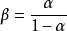

# 三极管

## 定义

三极管，全称应为半导体三极管，也称双极型晶体管、晶体三极管，是一种控制电流的半导体器件。其作用是把微弱信号放大成幅度值较大的电信号，也用作无触点开关。

三极管是半导体基本元器件之一，具有电流放大作用，是电子电路的核心元件。三极管是在一块半导体基片上制作两个相距很近的PN结，两个PN结把整块半导体分成三部分，中间部分是基区，两侧部分是发射区和集电区，排列方式有PNP和NPN两种。

## 产品作用

晶体三极管具有电流放大作用，其实质是三极管能以基极电流微小的变化量来控制集电极电流较大的变化量。这是三极管最基本的和最重要的特性。我们将ΔIc/ΔIb的比值称为晶体三极管的电流放大倍数，用符号“β”表示。电流放大倍数对于某一只三极管来说是一个定值，但随着三极管工作时基极电流的变化也会有一定的改变。

## 理论原理

晶体三极管（以下简称三极管）按材料分有两种：锗管和硅管。而每一种又有NPN和PNP两种结构形式，但使用最多的是硅NPN和锗PNP两种三极管，（其中，N是负极的意思（代表英文中Negative），N型半导体在高纯度硅中加入磷取代一些硅原子，在电压刺激下产生自由电子导电，而P是正极的意思（Positive）是加入硼取代硅，产生大量空穴利于导电）。两者除了电源极性不同外，其工作原理都是相同的，下面仅介绍NPN硅管的电流放大原理。

对于NPN管，它是由2块N型半导体中间夹着一块P型半导体所组成，发射区与基区之间形成的PN结称为发射结,而集电区与基区形成的PN结称为集电结,三条引线分别称为发射极e （Emitter）、基极b (Base)和集电极c (Collector)。如右图所示

当b点电位高于e点电位零点几伏时，发射结处于正偏状态，而C点电位高于b点电位几伏时，集电结处于反偏状态，集电极电源Ec要高于基极电源Eb。

在制造三极管时，有意识地使发射区的多数载流子浓度大于基区的，同时基区做得很薄，而且，要严格控制杂质含量，这样，一旦接通电源后，由于发射结正偏，发射区的多数载流子（电子）及基区的多数载流子（空穴）很容易地越过发射结互相向对方扩散，但因前者的浓度基大于后者，所以通过发射结的电流基本上是电子流，这股电子流称为发射极电流子。

由于基区很薄,加上集电结的反偏，注入基区的电子大部分越过集电结进入集电区而形成集电极电流Ic，只剩下很少（1-10%）的电子在基区的空穴进行复合，被复合掉的基区空穴由基极电源Eb重新补给，从而形成了基极电流Ibo.根据电流连续性原理得：
Ie=Ib+Ic

这就是说，在基极补充一个很小的Ib，就可以在集电极上得到一个较大的Ic，这就是所谓电流放大作用，Ic与Ib是维持一定的比例关系，即：
β1=Ic/Ib

式中：β1--称为直流放大倍数，

集电极电流的变化量△Ic与基极电流的变化量△Ib之比为：
β= △Ic/△Ib

式中β--称为交流电流放大倍数，由于低频时β1和β的数值相差不大，所以有时为了方便起见，对两者不作严格区分，β值约为几十至一百多。

α1=Ic/Ie(Ic与Ie是直流通路中的电流大小)
式中：α1也称为直流放大倍数，一般在共基极组态放大电路中使用，描述了射极电流与集电极电流的关系。
α =△Ic/△Ie

表达式中的α为交流共基极电流放大倍数。同理α与α1在小信号输入时相差也不大。
对于两个描述电流关系的放大倍数有以下关系

三极管的电流放大作用实际上是利用基极电流的微小变化去控制集电极电流的巨大变化。 

三极管是一种电流放大器件，但在实际使用中常常通过电阻将三极管的电流放大作用转变为电压放大作用。

## 放大原理

1、发射区向基区发射电子

电源Ub经过电阻Rb加在发射结上，发射结正偏，发射区的多数载流子(自由电子）不断地越过发射结进入基区，形成发射极电流Ie。同时基区多数载流子也向发射区扩散，但由于多数载流子浓度远低于发射区载流子浓度，可以不考虑这个电流，因此可以认为发射结主要是电子流
。
2、基区中电子的扩散与复合

电子进入基区后，先在靠近发射结的附近密集，渐渐形成电子浓度差，在浓度差的作用下，促使电子流在基区中向集电结扩散，被集电结电场拉入集电区形成集电极电流Ic。也有很小一部分电子（因为基区很薄）与基区的空穴复合，扩散的电子流与复合电子流之比例决定了三极管的放大能力。

3、集电区收集电子

由于集电结外加反向电压很大，这个反向电压产生的电场力将阻止集电区电子向基区扩散，同时将扩散到集电结附近的电子拉入集电区从而形成集电极主电流Icn。另外集电区的少数载流子（空穴）也会产生漂移运动，流向基区形成反向饱和电流，用Icbo来表示，其数值很小，但对温度却异常敏感。

## 工作状态

- 截止状态

当加在三极管发射结的电压小于PN结的导通电压，基极电流为零，集电极电流和发射极电流都为零，三极管这时失去了电流放大作用，集电极和发射极之间相当于开关的断开状态，我们称三极管处于截止状态。

- 放大状态

当加在三极管发射结的电压大于PN结的导通电压，并处于某一恰当的值时，三极管的发射结正向偏置，集电结反向偏置，这时基极电流对集电极电流起着控制作用，使三极管具有电流放大作用，其电流放大倍数β=ΔIc/ΔIb，这时三极管处放大状态。

- 饱和导通

当加在三极管发射结的电压大于PN结的导通电压，并当基极电流增大到一定程度时，集电极电流不再随着基极电流的增大而增大，而是处于某一定值附近不怎么变化，这时三极管失去电流放大作用，集电极与发射极之间的电压很小，集电极和发射极之间相当于开关的导通状态。三极管的这种状态我们称之为饱和导通状态。
根据三极管工作时各个电极的电位高低，就能判别三极管的工作状态，因此，电子维修人员在维修过程中，经常要拿多用电表测量三极管各脚的电压，从而判别三极管的工作情况和工作状态。